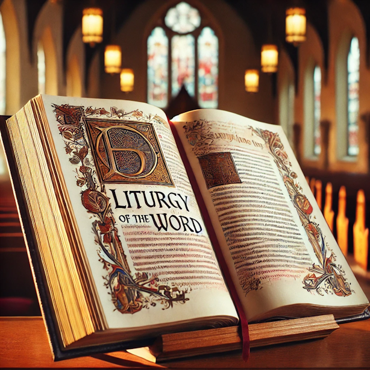
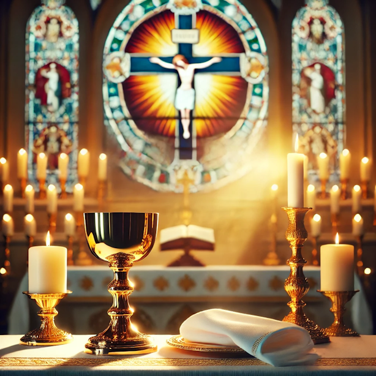

# Second Sunday of Christmas

January 5th, 2025

---

Jesus is the One sent by God who speaks to us about the wisdom and truth of God. By accepting him we too become children of God and are filled with grace and truth.

---

# Entrance Antiphon

---

When a profound silence covered all things and night was in the middle of its course, your all-powerful Word, O Lord, bounded from heaven's royal throne.

---

# Penitential Act

---

Lord Jesus, you raise us to new life:  
Lord, have mercy.  

***Lord, have mercy.***

---

Lord Jesus, you forgive us our sins:  
Christ, have mercy.  

***Christ, have mercy.***

---

Lord Jesus, you feed us with your body and blood:  
Lord, have mercy.

***Lord, have mercy.***

---

May almighty God have mercy on us

***Amen.***

---

# The Gloria

---

Glory to God in the highest,  
and on earth peace to people of good will.  
We praise you, we bless you,  

---

we adore you, we glorify you,  
we give you thanks for your great glory,  
Lord God, heavenly King,  

---

O God, almighty Father.  
Lord Jesus Christ, Only Begotten Son,  
Lord God, Lamb of God, Son of the Father,  

---

you take away the sins of the world,  
have mercy on us;  
you take away the sins of the world,  

---

receive our prayer;  
you are seated at the right hand  
of the Father,  

---

have mercy on us.  
For you alone are the Holy One,  
you alone are the Lord,  

---

you alone are the Most High,  
Jesus Christ, with the Holy Spirit,  
in the glory of God the Father. Amen.

---

# Opening Prayer

---

Almighty ever-living God, splendour of faithful souls, graciously be pleased to fill the world with your glory, 

---

and show yourself to all peoples by the radiance of your light. Through our Lord Jesus Christ

---

# Liturgy Of The Word

---

# Responsorial Psalm

***The word was made flesh, and lived among us.***

---

# Gospel Acclamation

---

Alleluia, alleluia!  
Glory be to you, O Christ, proclaimed to the pagans; Glory be to you, O Christ, believed in by the world.

**Alleluia!**

---

# Apostles' Creed

---

I believe in God, the Father almighty,  
Creator of heaven and earth,  
and in Jesus Christ, his only Son, our Lord,  

---

*(All bow for the following two lines)*:  
who was conceived by the Holy Spirit,  
born of the Virgin Mary,  

---

suffered under Pontius Pilate,  
was crucified, died and was buried;  
he descended into hell;  

---

on the third day he rose again from the dead;  
he ascended into heaven,  
and is seated at the right hand of God,  

---

the Father almighty;  
from there he will come to judge  
the living and the dead.  

---

I believe in the Holy Spirit,  
the holy catholic Church,  
the communion of saints,  

---

the forgiveness of sins,  
the resurrection of the body,  
and life everlasting. Amen.

---

# Prayers Of The Faithful

---

Father, as we continue to celebrate your wonderful gift of the Word made flesh, we bring our prayers to you with hope and joy.

---

In today’s Gospel, we read these words about Jesus – He was in the world, yet the world did not know him. He came to his own, and his own did not accept him.

---

We pray to the Lord  
***R: Lord hear us***

---

As we begin this New Year, we pray for all followers of Christ and for a new beginning in our Church.

We pray to the Lord  
***R: Lord hear us***

---

We pray for all those who have helped and supported the poor and needy in our parish and community over this Christmas holiday period.

We pray to the Lord  
***R: Lord hear us***

---

As we mark the first week of the Church’s Jubilee Year 2025, we pray with Pope Francis for an end to war and oppression

We pray to the Lord  
***R: Lord hear us***

---

We pray for our youth of this parish who return to school this week. We pray that they may be safe in their travels, in their homes, at school and at play.

We pray to the Lord  
***R: Lord hear us***

---
We bow our heads and remember in silence our own personal intentions and the intentions of those who have asked for our prayers.

We pray to the Lord  
***R: Lord hear us***

---

Father, we ask you today to plant the seed of your love in our hearts that we may never stray or be lost to you in our daily lives. We make this prayer through Jesus Christ, our Lord. Amen.

---

# Liturgy Of The Eucharist

Through Christ our Lord.

---

# The Mystery of Faith

We proclaim your Death, O Lord, and profess your Resurrection until you come
again.

---

# Our Father

---

Our Father, who art in heaven,  
hallowed be Thy name;  
Thy kingdom come;  

---

Thy will be done on earth as it is in heaven.  
Give us this day our daily bread,  
and forgive us our trespasses,  

---

as we forgive those who trespass against us;  
and lead us not into temptation,  
but deliver us from evil.  
Amen.  

---

# Communion Antiphon

---

**To all who would accept him, he gave the power to become children of God.**

---

# Jubilee Prayer

---

**Heavenly Father,**  
May the faith in Jesus Christ and the fire of love from the Holy Spirit renew our hope for your Kingdom.  

---

Transform us into sowers of the Gospel, bringing hope to humanity and creation, as we await the new heaven and earth where Christ reigns.  
***Amen.***

---

# Prayer After Communion

---

Lord our God, we humbly ask you, that, through the working of this mystery, our
offences may be cleansed and our just desires fulfilled.  
Through Christ our Lord.  
Amen.

---

## Go in the Peace of Christ

