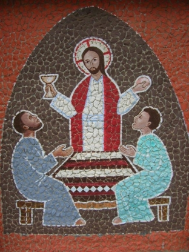

# The Way of Light beyond the Cross

Download the PDF version of this booklet [here](http://www.salesianmissions.co.za/The-Way-of-Light-beyond-the-Cross-stations-booklet.pdf).  

The 14 stations from Easter to Pentecost  

**INSTRUCTIONS** - At each station:  
*The event is announced*  
*Short refrain:*  

*L. We adore you O Christ and we praise you;*  

***R. Because by your resurrection you fill us with hope and joy, Alleluia!***  

*The short scripture passage is read by a leader.*  
*All join in the short prayer at the invitation: Let us pray.*  
*All join the short hymn at the invitation – Let us sing*  

## Introduction: Acts 13:30-33

"God raised Jesus from the dead, and for many days he was seen by those who had traveled with him from Galilee to Jerusalem. They are now witnesses for him to the people of Israel. And we are here to bring the Good News to you! What God promised our ancestors he would do, he has now done for us, who are their descendants, by raising Jesus to life."  

## First Station: Jesus is Risen! The women discover that the tomb where Jesus was placed is empty  

*Very early on Sunday morning, the women went to the tomb, carrying the spices they had prepared. They found the stone rolled away from the entrance to the tomb, so they went in; but they did not find the body. Suddenly two men in bright shining clothes stood by them and said: "Why are you looking among the dead for one who is alive? He is not here; he is risen!" Luke 24:1- 9 (John 20:1-2 / Matthew 28:1-10/ Mark 16:1-8)*  

### Let us pray

Risen Lord, your resurrection is truly good news! We praise you for your victory over sin and death! Your resurrection brings us hope, salvation and the beginning of a new life in you! Help us to keep growing in the conviction that at the end, our life is not ended, only changed! Amen.  

### Let us sing

Sing Alleluia to the Lord (x2)  
Sing Alleluia sing Alleluia.  
Sing Alleluia to the Lord!  
Jesus is risen from the dead (x2)  
Jesus is risen, Jesus is risen.  
Jesus is risen from the dead!  

## Second Station: Peter and John run to the tomb

  

*Peter and John ran to the tomb. They went in and saw the linen cloth lying there… They saw and they believed! John 20:3-9 (Luke 24:10-12)*  

### Let us pray

Risen Lord, as we stand before your empty tomb, you invite us to experience what Peter and John experienced. As we reflect on the mystery of your death and resurrection, grant us the grace to understand more fully the blood by which we were redeemed and the Spirit by which we are reborn. Amen.  

### Let us sing

This is the day! When he rose again!  
Let us rejoice! And be glad in it.
\+ This is the day that the Lord has made;  
let us rejoice and be glad in it  
This is the day when he rose again!  

## Third Station: Jesus appears to Mary of Magdala

Mary stood crying outside the tomb. She bent over and saw two angels sitting where the body of Jesus had been. "Woman, why are you crying?" they asked her. She turned around and saw Jesus standing there although she did not recognise him. Thinking he was the gardener she said: "Tell me where you have put him and I will go fetch him!" Jesus said to her: "Mary!" facing him she replied: "Rabboni", meaning "master!" John 20:11-18*  

### Let us pray

Risen Lord, you provided Mary of Magdala the opportunity to be the first to witness your risen self, and you commissioned her to go spread the news. As with Mary, you call us all by our name and you ask us to share this good news with all whom we meet. Help us to do so courageously. Amen.  

### Let us sing

\+ Alleluia Alleluia give thanks to the risen Lord;  
Alleluia Alleluia give praise to his name!  
Spread the good news over all the earth – Jesus has died and is risen! +  

## Fourth Station: Jesus joins two disciples on the road to Emmaus

*Jesus said to them: "What are you talking about as you walk along?" They stood still with sad faces. One of them replied: "You must be the only one in Jerusalem who doesn’t know the things that have been happening there these last few days!" Then Jesus said: "How foolish you are; how slow you are to believe everything the prophets wrote." And he went on to explain what was said about himself in all the scriptures, beginning from the books of Moses to the writings of all the prophets. Luke 24:13-27*  

### Let us pray

Risen Lord, you joined your two disciples as in their confusion they tried to walk away from it all. You helped them to understand the true meaning of the events that had made them so sad. Their invitation: "Stay with us" has become our prayer. Help us to keep recognising you in the ones who walk beside us in our times of trouble. Amen.  

### Let us sing

Jesus promised life to all  
Walk, walk in the Light!  
The dead were wakened by his call!  
Walk, walk in the Light!  
\+ Walk in the Light [x3],  
walk in the Light of God!  
He died in pain on Calvary, Walk...  
To save the lost like you and me, Walk... +  

## *Fifth Station: Jesus is recognised in the breaking of bread

*As they reached the village to which they were going, Jesus acted as if he intended to go on further, but they held him back saying: "Stay with us; the day is almost over and it is getting dark!" So he went in and sat down to eat with them. He took bread, said the blessing, broke it and gave it to them. At that moment their eyes were opened and they recognised him, but he vanished from their sight. They said to each other then: "Wasn’t it like a fire burning in us when he talked to us on the road explaining the scriptures?" Luke 28-35*  

### Let us pray

Risen Lord, as the two disciples recognised you in the breaking of bread, they recognised themselves also. They were still your disciples! Your words restored their faith in you. Every time we celebrate the Eucharist, you invite us to be restored again as your followers, as we listen to your Word and share in your Body and Blood. Amen.  

## Let us sing

Are not our hearts burning within us?  
Are not our hearts lighted with fire?  
Jesus is with us is risen is with us;  
Jesus is risen is with us today!  
Jesus is the Lord! Jesus is the Lord!  

## Sixth Station: Jesus appears to a group of the apostles behind closed doors

*As they were eating, suddenly the Lord himself stood among them: "Peace be with you" he said. But they were terrified thinking that they were seeing a ghost. He said to them: "Why are you so afraid? Why all these doubts in your minds? Look at my hands and my feet, and see that it is I. A ghost does not have flesh and bones as you can see I have! They still could not believe, even though they were filled with joy and wonder. He asked them: "Have you anything to eat? They gave him a piece of cooked fish, which he took and ate in their presence. Luke 24:36-43*  

### Let us pray

Risen Lord, we still find it hard to believe in your resurrection and ours. We have no proof! But help us to notice the signs you provide us with in nature around us; that as the seed sprouts into life, and as sure as the sun rises again every morning, so certain can we be that death is not only a tombstone but a stepping stone into eternal life! Amen.  

### Let us sing

\+ Keep in mind that Jesus Christ has died for us  
and is risen from the dead!  
You are our risen Lord; you are joy for all ages!  
In you Lord our challenge, in you all our hope!  
In you our salvation, in you all our love.  

## Seventh Station: Jesus empowers his disciples to forgive sins

*Again Jesus came and stood among them as they were gathered behind locked doors. "Peace be with you" he said. "As the Father sent me, so I am sending you!" Then he breathed on them and said: "Receive the Holy Spirit. Those whose sins you forgive, will be forgiven. Those whose sins you retain, they are retained!" John 20:21-23*  

### Let us pray

Risen Lord, you appeared to the apostles and breathed the Holy Spirit upon them; pour out on us your healing Spirit, that we may continue your mission of bringing forgiveness to our wounded world. Amen.  

### Let us sing

God forgave my sins in Jesus’ name,  
I’ve been born again in Jesus’ name;  
And in Jesus’ name I come to you,  
To share his love as he told me to!  
He said: "Freely Freely you have received;  
Freely Freely give!  
Go in my name and because you believe,  
Others will know that I live!"  

## Eighth Station: Jesus confirms the faith of Thomas

*Thomas was not with them when Jesus came, and he refused to believe them. Eight days later the disciples were in the house and Thomas was with them. The doors were closed but Jesus came and stood among them. He said to Thomas: "Reach out your hand and put it into my side. Look at my hands! Doubt no longer, but believe!" Thomas said: "My Lord and my God!" Jesus replied: "You believe because you can see me. Blessed are they who will believe without having seen me." John 20:24-29*  

### Let us pray

Risen Lord, you renewed the faith of Thomas in you as the Risen one! His faith is the faith of the Church. Preserve the church you built on the apostles, deepen our faith in your final victory, and help us find strength in the hope of your coming again. Amen.  

### Let us sing

You are Lord, you are Lord,  
You are risen from the dead and you are Lord!  
Every knee shall bow and every tongue confess,  
That Jesus you are Lord!  

## Ninth Station: Jesus appears on the shore of lake Tiberias

Simon-Peter said to the other disciples: "I’m going fishing". "We’ll come with you!" they replied. So they went out in the boat but caught nothing all night. As day broke, Jesus stood on the shore, though the disciples did not realise it was Jesus. Jesus called out: Have you caught anything friends?" And when they answered "No!", he said to them: "Throw the net out to starboard and you’ll get something." They did so and there were so many fish that they could not haul the net in. The disciple Jesus loved said: "It is the Lord!" John 21:1-19*  

### Let us pray

Risen Lord, in the sign of so many fish gathered in the single unbroken net, you indicate your desire that all people of all nations be gathered into one holy people. As you directed your disciples to that great catch of fish, continue to direct us in the way of unity. Amen.  

### Let us sing

Lord you have come to the lakeside;  
Seeking neither wealthy nor wise ones.  
You only ask Lord, that I should love you.  
With love you have looked in my eyes Lord,  
Smiling gently you called out my name.  
And I left my boat by the lakeside,  
Now with you I will seek other shores!  

## Tenth Station: Jesus commissions Peter to take care of his flock, the Church

*Jesus then asked Peter three times: "Simon, son of John, do you love me more than these others do?" He answered: "Yes Lord, you know how much I love you!" Jesus said to him: "Feed my lambs! Take care of my sheep!" John 21:15- 18*  

### Let us pray

Risen Lord, you not only forgave Peter for denying you three times, you appointed him to be the leader of your followers, the Shepherd of your flock. Having recommitted himself to love you to the end, he assumed the responsibility of leading your people in discovering healing through your loving forgiveness. May the successor of Peter continue to preserve your church in the way of truth and life, and may we too be faithful in fulfilling our mission to spread the good news of salvation. Amen.  

### Let us sing

Colours of day dawn into the mind  
The sun has come up the night is behind.  
Go down in the city, into the street,  
And let’s give the message to the people we meet.  
\+ So light up the fire and let the flame burn,  
Open the door, let Jesus return.  
Take seeds of his Spirit, let the fruit grow,  
Tell the people of Jesus let his love show.  
Go through the park on into the town  
The sun still shines on, it never goes down.  
The light of the world is risen again,  
The people of darkness need the Good News! +  

## Eleventh Station: Jesus entrusts his disciples with his mission to the whole world

*Jesus said to them: "Go throughout the whole world and preach the gospel to all mankind. Whoever believes and is baptised will be saved. Whoever does not believe will be condemned. And believers will be given the power to perform miracles. They will drive out demons in my name; they will speak in strange tongues; if they pick up snakes or drink poison, they will not be harmed; they will place their hands on the sick, and these will be healed!" Mark 16:15-18*  

*(Matthew 28:16-20 / Acts 1:6-8 / Luke 24:46-47)*  

### Let us pray

Risen Lord, you helped your disciples to understand the wonderful mystery of your death and resurrection. Then you entrusted them with the task of being messengers of hope and bearers of the good news of your victory over sin and death. As we strive to pursue their mission, help us to manifest your resurrection by our way of life. Amen.  

### Let us sing

God’s Spirit is in my heart,  
He has called me and set me apart;  
This is what I have to do; what I have to do.  
He sent me to bring the good news to the poor;  
Tell prisoners that they are prisoners no more!  
Tell blind people that they can see;  
And set the downtrodden free!  
And go tell everyone the news that the Kingdom of God has come.  
And go tell everyone the news that God’s Kingdom has come.  

## Twelfth Station: Jesus ascends into heaven

*Then he led them out as far as Bethany, and blessed them with uplifted hands; and in the act of blessing them, he parted from them. They still had their eyes fixed on him when two men dressed in white suddenly stood beside them and said: "Galileans, why are you standing there looking up at the sky? This Jesus who was taken from you into heaven will come back in the same way you saw him go to heaven!" Luke:24:50-52 / Acts 1:9-11*  

### Let us pray

Risen Lord, your promise of the gift of the Holy Spirit and your promise to be with us always, fills us with joy. Where you, the head have preceded us in glory, we, the body, hope to follow. Seated at the right hand of the Father, intercede for us now, as we place all our trust in you, our eternal priest. Amen.  

### Let us sing

Jesus, name above all names  
Beautiful Saviour, glorious Lord.  
Emmanuel, God is with us,  
Blessed Redeemer, living Word!  

## Thirteenth Station: Mary and the apostles wait for the coming of the Holy Spirit

*The apostles then went back to the city and to the room where they had been staying. They gathered frequently to pray as a group, together with the women and with Mary the mother of Jesus. Acts 1:12-14*  

### Let us pray

Risen Lord, this little group of your followers waiting and praying together in the Upper Room was the church in embryonic form. Gathered still with the whole communion of saints, we pray that you will again pour out the gifts of the Holy Spirit on all people and so fulfil in the hearts of your faithful what you accomplished when the Gospel was first preached on earth. Amen.  

### Let us sing

Spirit of the living God, fall afresh on me/us (x2)  
Melt me, mould me, fill me, use me!  
Spirit of the living God, fall afresh on me/us!  

## Fourteenth Station: Pentecost – The Holy Spirit descends upon the apostles in the form of tongues of fire

*When the day of Pentecost came, all the believers were gathered together in one place. Suddenly there was a noise from the sky which sounded like a strong wind blowing, and it filled the whole house where they were sitting. Then they saw what looked like tongues of fire which spread out and touched each person there. They were all filled with the Holy Spirit and began to talk in other languages as the Spirit enabled them to speak!" Acts 2:1-42*  

### Let us pray

God our Father, we thank you for sending us your only Son to call us into your Kingdom. Set us on fire like his first disciples, with the power of the Holy Spirit. Help us to act justly, to love tenderly, and to walk humbly with you. Help us to become a community serving humanity in your great plan to renew the face of the earth. We ask this through Christ our Lord. Amen.  

### Let us sing

Sing Alleluia to the Lord (x2)  
Sing Alleluia, sing Alleluia,  
Sing Alleluia to the Lord!  
Come Holy Spirit fill our hearts. (x2)  
And kindle in them the fire of your love.  
Come Holy Spirit fill our hearts!  

## Final Prayer

Father, so great is your love for us that you call us your children. Even more, you sent Jesus to show us how to live, he who is the Way the Truth and the Life. Bless us now with the gift of the Holy Spirit that we might pray with conviction; "Come Lord Jesus!" Help us to know him better and to share our experience of him with others as we prepare for and cross the threshold into the third millennium. We make our prayer through Christ our Lord. Amen.  
